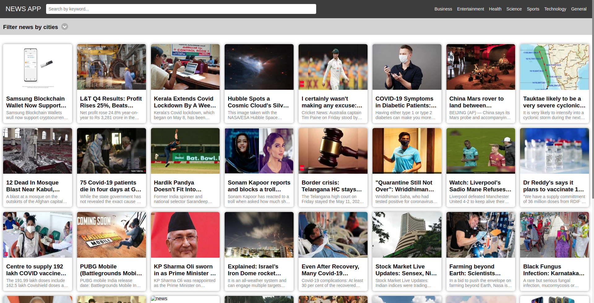
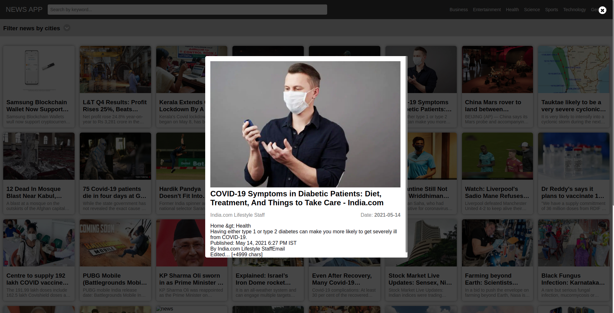
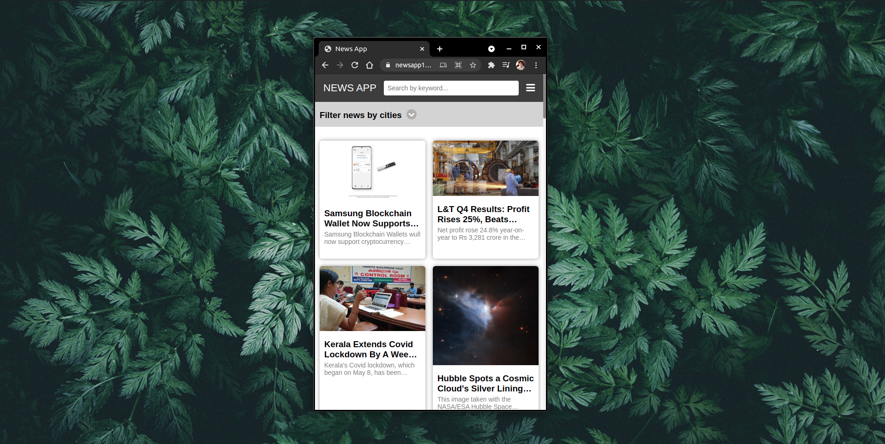
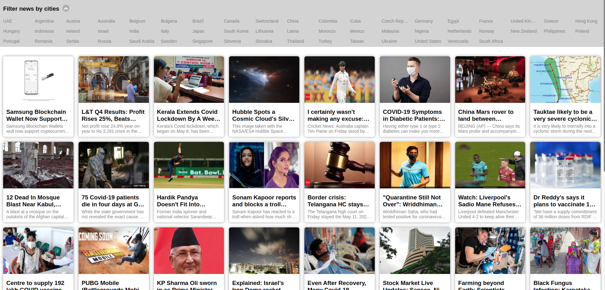

<h1 align="center">NEWS APP</h1>
  <p align="center">
    A simple News web app for updating yourself with daily news.
    <br>
    Live Site - https://newsapp14.herokuapp.com/
    <br />
    <a href="https://github.com/DebjitPramanick/News-App">View Demo</a>
    ·
    <a href="https://github.com/DebjitPramanick/News-App/issues">Report Bug</a>
    ·
    <a href="https://github.com/DebjitPramanick/News-App/issues">Request Feature</a>
  </p>
</p>


<!-- TABLE OF CONTENTS -->
<details open="open">
  <summary>Table of Contents</summary>
  <ol>
    <li>
      <a href="#about-the-project">About The Project</a>
      <ul>
        <li><a href="#built-with">Built With</a></li>
      </ul>
    </li>
    <li>
      <a href="#getting-started">Getting Started</a>
      <ul>
        <li><a href="#prerequisites">Prerequisites</a></li>
        <li><a href="#installation">Installation</a></li>
      </ul>
    </li>
    <li><a href="#roadmap">Roadmap</a></li>
    <li><a href="#contributing">Contributing</a></li>
    <li><a href="#contact">Contact</a></li>  </ol>
</details>


<!-- ABOUT THE PROJECT -->
## About The Project


<br>

This is a simple news web app using Django and Newsapi.org.
A list of commonly used resources that I find helpful are listed in the acknowledgements.

### Built With
* [Django](https://www.djangoproject.com/)
* [News API](https://newsapi.org/)


<!-- GETTING STARTED -->
## Getting Started

To get a local copy up and running follow these simple example steps.

### Prerequisites

These things must be installed in your system.
* [Python3](https://www.python.org/downloads/)

### Installation

1. Clone the repo
   ```sh
   git clone https://github.com/DebjitPramanick/News-App.git
   ```
3. Install Django
   ```sh
   pip  install  django
   ```
4. Open the project folder
5. Now type
    ```sh
   cd newsapp
   ```
5. Now type
    ```sh
   python3 manage.py runserver
   ```
   
<!-- USAGE EXAMPLES -->
## Usage

Here are some examples of how my app works.
<br>

<br>

<br>

<br>

<!-- ROADMAP -->
## Roadmap

See the [open issues](https://github.com/DebjitPramanick/News-App) for a list of proposed features (and known issues).


<!-- CONTRIBUTING -->
## Contributing

Contributions are what make the open source community such an amazing place to be learn, inspire, and create. Any contributions you make are **greatly appreciated**.

1. Fork the Project
2. Create your Feature Branch (`git checkout -b feature/AmazingFeature`)
3. Commit your Changes (`git commit -m 'Add some AmazingFeature'`)
4. Push to the Branch (`git push origin feature/AmazingFeature`)
5. Open a Pull Request


<!-- CONTACT -->
## Contact

Twitter - [@P_Debjit](https://twitter.com/P_Debjit) 
LinkedIn - [Debjit Pramanick](https://www.linkedin.com/in/debjit-pramanick-7a6a971b1/)
Project Link: [https://github.com/DebjitPramanick/Blockcahin-To-Do-List](https://github.com/DebjitPramanick/Blockcahin-To-Do-List)